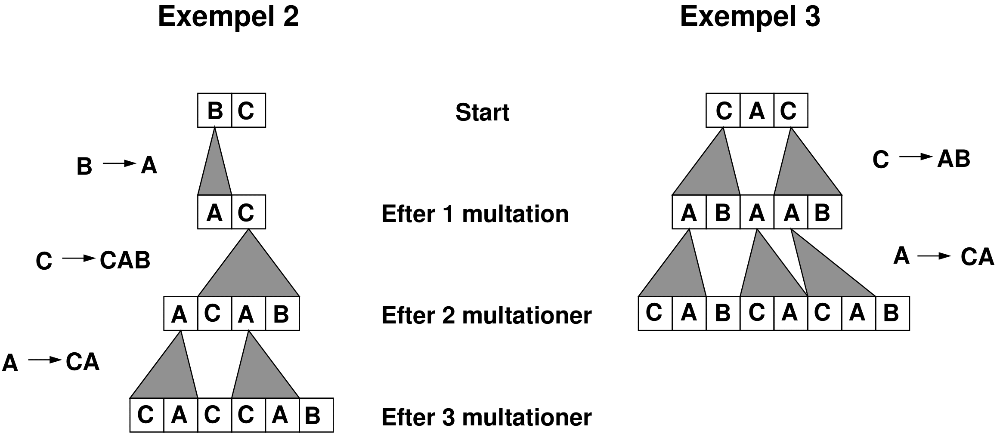

On the undiscovered exoplanet PO-2019, the population's genetic material
consists of a string where each character is either `A`, `B`, or `C`.
The elovution of life has progressed faster there than on earth
(for example, everyone can solve programmering problems already as newborns).
The reason is believed to be that instead of regular mutations, ”multations”
occur, which change all occurrences of a certain letter simultaneously. The
letter is replaced with a string that can contain 1, 2, or 3 letters (see the
figure below). This means that the length of the genome can increase quite quickly.

Write a program that, given two strings $S$ and $T$, prints the shortest sequence of
multations that changes $S$ to $T$. There will always be a solution with at most $3$ multations.

# Input
The first line of input contains the string $S$.

The second line contains the string $T$.

None of the strings contain more than $10$ letters and each letter is
either `A`, `B` or `C`.

# Utdata
Print the shortest multation sequence, each multation on its own line,
in the order they occur. Each line should countain two strings:
the letter that changed, and the letter it changed into.

If there are multiple optimal sequences, you can print any of them.

| Group   | Points   | Constraints              |
|---------|----------|--------------------------|
| $1$     | $20$     | $S$ and $T$ have the same length.|
| $2$     | $40$     | There exists an optimal sequence that consists of the same multation, but potentially repeated several times. |
| $3$     | $40$     | Inga ytterligare begränsningar. |

{width="40%"}
